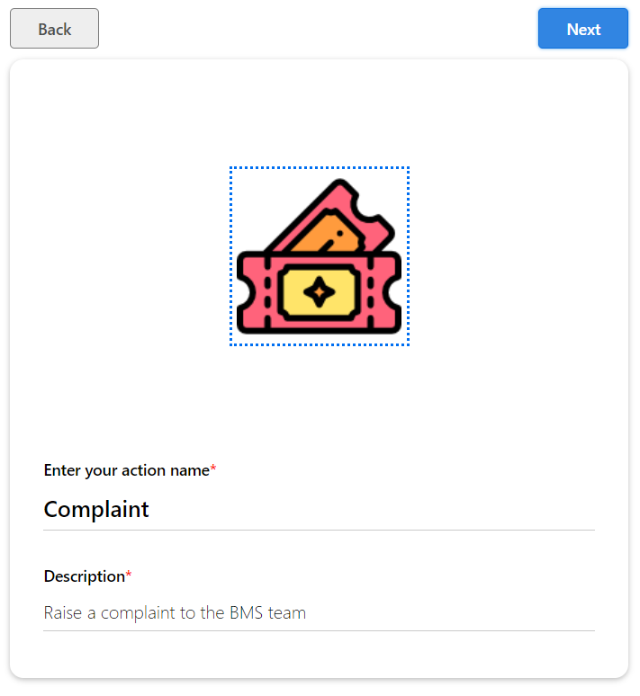
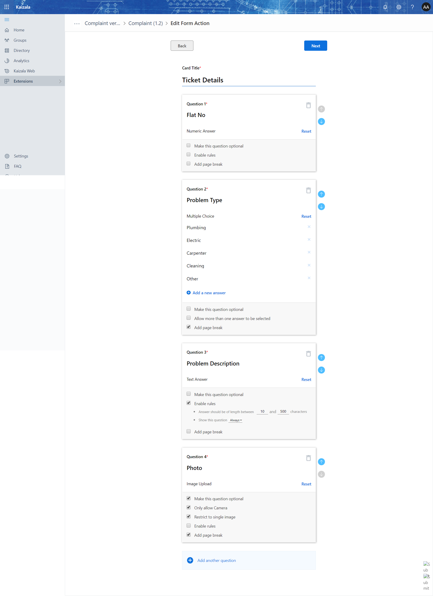

# Compliant for "Residents"
This Action Card & Flow would help residents to raise a complaint.

When a complaint is raised by the resident, The system should send acknowledgement with complaint number to resident and post an action card to "Operations" group. Operations team can also take actions.

- Create a list with name as "Complaints"
    Add the below list of columns 
    - "Flat No"
    - "Problem Type"
    - "Problem Description"
    - "Photo of ticket"
    - "Comments"
    - "Feedback PhoneNumber"
    - "User"
    - "Status" - This is a dropdown as "Submitted, Re-opened, Closed, Working", default is "submitted".
    - "Reopen Comments"
    - "phnumber"
- Create a Action card 
    -  Step 1: 
    -  Step 2: 
    -  Import two more actions cards
        - Step 3: Action Card used by operations team to update the status.
        [Update from operations](Media/Complaint/Operations.ComplaintUpdate.zip)
        - Step 4: Action Card used by the residents to reopen the ticket. [Reopen ticket by residents](Media/Complaint/Complaint.Resident.TicketStatus.zip)
    
    Download the package by clicking on different flow packages, While importing the package, choose the connections by authentication.
    -  Step 4: [Complaint Flow](Media/Complaint/RaiseComplaint_20190320004523.zip) (Custom Action card is posted to get update from operations team.)
    -  Step 5: [Update from Operations](Media/Complaint/RaiseComplaint_20190320004523.zip) (Operations team would update the status and comments would be added.)
    -  Step 5: [Reopen ticket by Residents](Media/Complaint/RaiseComplaint_20190320004523.zip) (Residents would have a option to reopen the ticket with comments.)

- Login in to https://flow.microsoft.com and import the flow.