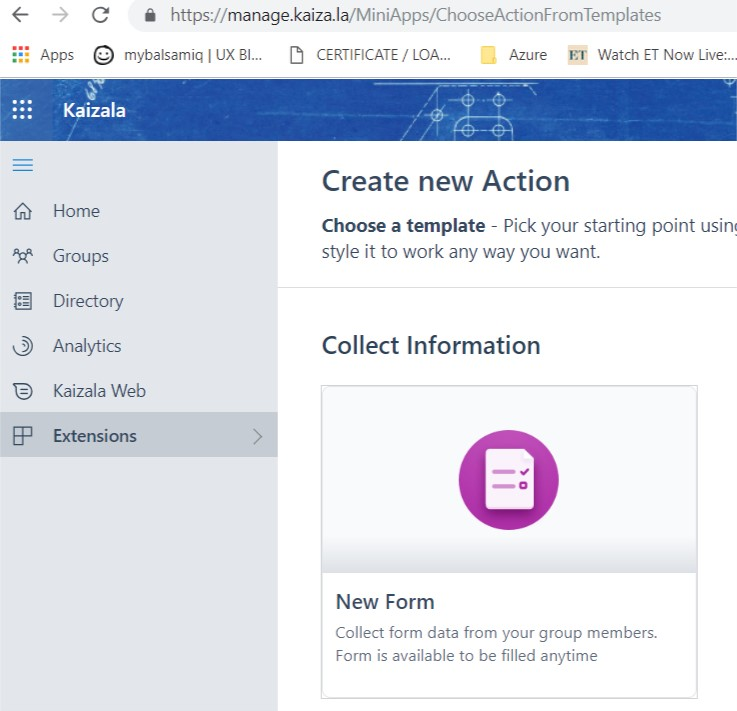
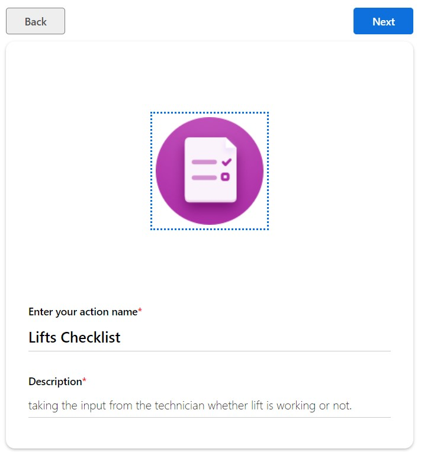
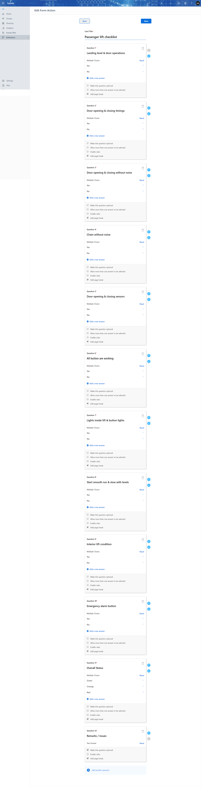

# Custom Checklist
This will help us to view the collective data in detailed survey reports.

##Points to be remembered.
The filled form will be visible to that member only. We need to activate the 

## Step 1: Choose the action card as "New Form"

## Step 2: Fill the Action name & Description

## Step 3: Create a from with all options

## Step 5: Check with the necessary details and submit

## Step 6: Stage and Activate
- Click on the stage button, if an existing version is added to a group, then you get warning message "Click on OK".
- Add to a group that was already created with the name as "Operations".
- Verify the action in stage condition and Activate the action.