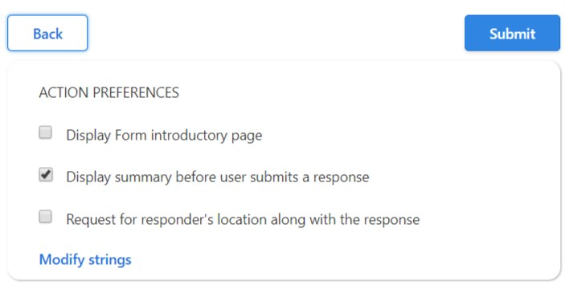
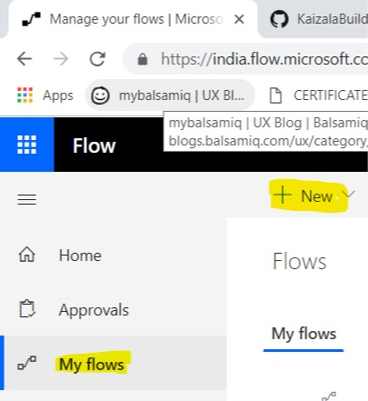
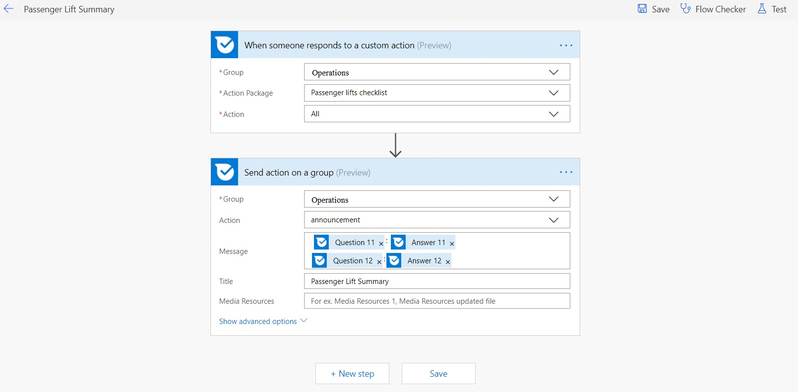
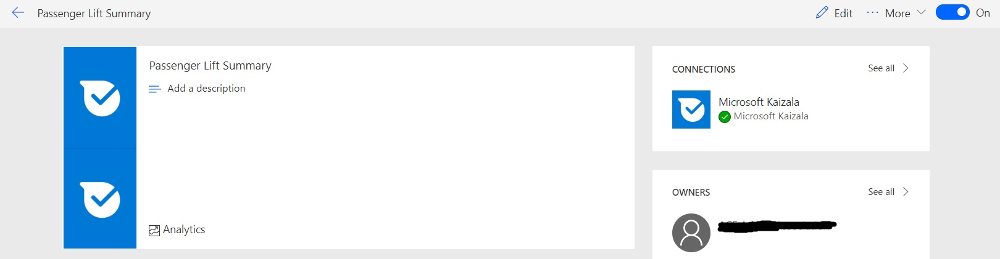

# Custom Checklist
This will help us to view the collective data in detailed survey reports.

Points to be remembered.
The filled form will be visible to that member only. We need to activate flow account and create flow so that all the members in the groups would know the status of the custom check list. 

## Step 1: Choose the action card as "New Form"

## Step 2: Fill the Action name & Description

## Step 3: Create a from with all options

## Step 4: Check the different options

## Step 5: Stage and Activate
- Click on the stage button, if an existing version is added to a group, then you get warning message "Click on OK".
- Add to a group that was already created with the name as "Operations".
- Verify the action in stage condition and Activate the action.

## Step 6: How to create a flow
Ensure that prerequisite section is fulfilled.

## Step 7: Create the actions to send an announcement 
This would share the summarized information to others in the group.

## Step 8: Enable the flow
