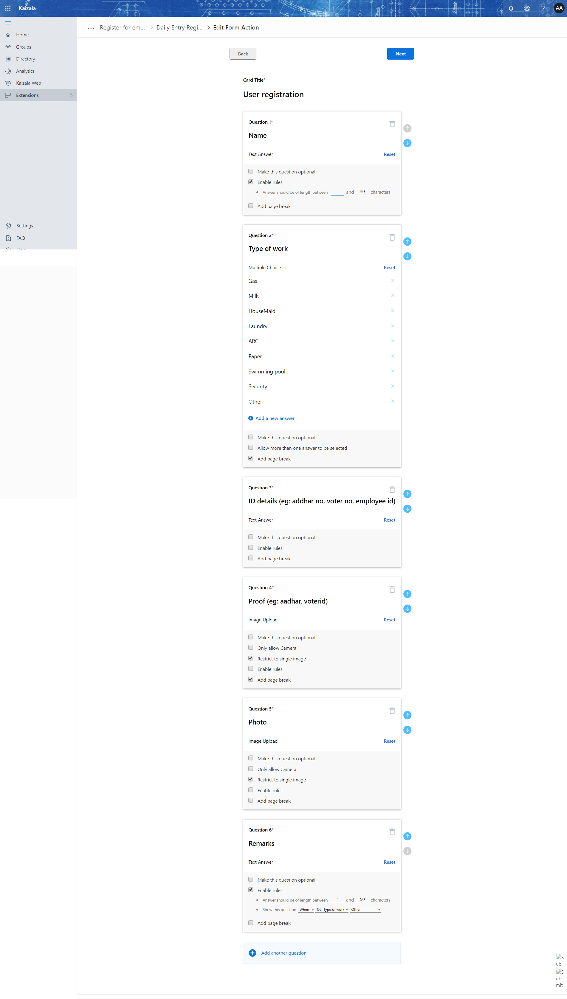
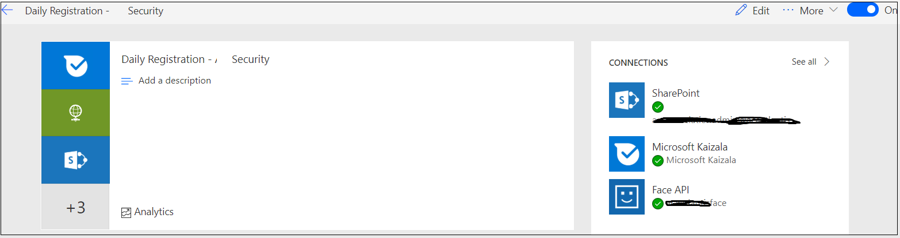
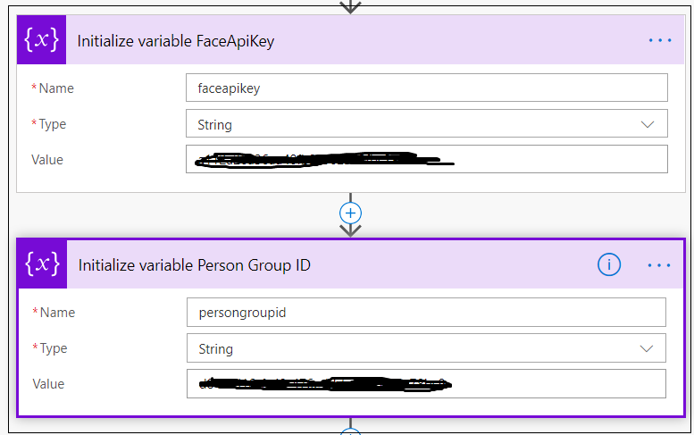

# Daily Entry Registration in "Security" group.

Register the daily visiting Helpers, House maid, Car cleaning, car drivers to support for the day to day activities of the residents. We will be using the FACE API to identify the person.

- Step 1: Login [azure](http://portal.azure.com) and complete the registration process.
- Step 2: 
    - Option 1: Follow the [link](https://azure.microsoft.com/en-in/services/cognitive-services/face/) and create the Face cognitive services in your azure subscription. 
    - Option 2: You can use the [ARM template](Media/DailyRegistration/CognitiveServices-BuildingMngmt.zip) Provided as zip, Pass the name as input parameter.
    
   ```
   Note: In the template it is pointing to "central-india" choose a region as per you need.
   Based on the region the face api url varies.
   ```
FACE API URL Refrence: https://westus.dev.cognitive.microsoft.com/docs/services/563879b61984550e40cbbe8d/operations/563879b61984550f30395236

- Step 3: Take the key from the Manage Keys


- Step 4: Need to upload few images to sharepoint. These images are used in announcements that a flow sends to security team.
    - Sharepoint images upload location

    - Images to be uploaded


- Step 5: Create Three list item in sharepoint
List 1: "Daily Visitor Registration"

| Column Name | Data Type |
| --- | --- |
| Flats | Single line of text |
| VisitorName | Single line of text |
| Purpose of visit | Multiple lines of text |
| IdDetails | Single line of text |
| Proof | Single line of text |
| Photo | Multiple lines of text |

List 2: "Identityfailure" - this would help us to identify on how the security team has taken photo

| Column Name | Data Type |
| --- | --- |
| PhotoUrl | Multiple lines of text |
| ResponderName | Single line of text |
| CardType | Single line of text |

List 3: "Daily Entry" - Used to record if the person is already registered and trying to register again

| Column Name | Data Type |
| --- | --- |
| Visitor Name  | Single line of text |
| PersonId | Single line of text |

- Step 6: Create the action card 
    
    

- Step 7: Import the flow [Zip](Media/DailyRegistration/DailyRegistraion-SecurityFlow.zip), While importing connect with the FACE API 


    - Need to update the "faceapikey"
    - Create the "PersonGroupID" from the face API using the postman or any other URL request posting tool.
    - Update the "PersonGroupId" in the initialize variables
