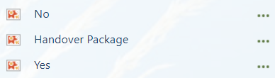
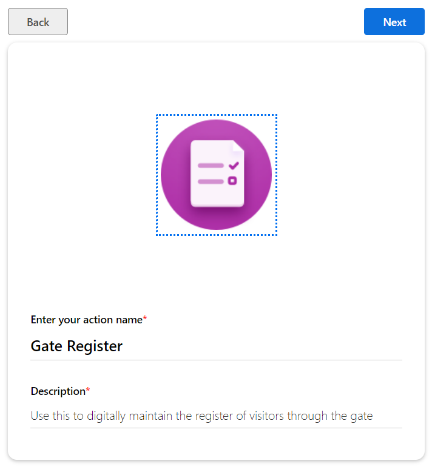
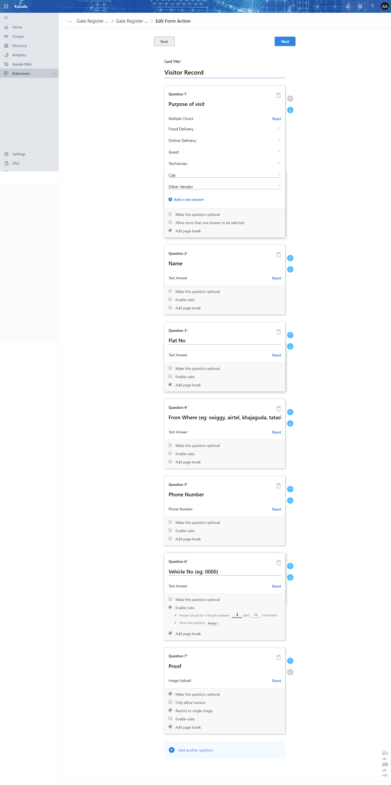

# Gate Entry for "Security"
Security officer at the entrance of the gate need to register the details of the person visiting your apartment has take the approval from the flat resident.

- Step 1: Create the [SharePoint list](https://support.office.com/en-us/article/Create-a-list-in-SharePoint-0D397414-D95F-41EB-ADDD-5E6EFF41B083)
    - List Name: "VisitorRecord"
    - List of columns

| Column Name | Data Type |
| --- | --- |
| Purpose of Visit | Single line of text |
| Visitor Name | Single line of text |
| Flat No | Single line of text |
| VehicleNumber | Single line of text |
| Where From | Single line of text |
| Registration Number | Single line of text |
| photourl | Multiple lines of text |
| Comments | Single line of text |

- Step 2: Need to upload few images to sharepoint. These images are used in announcements that a flow sends to security team.
    - Sharepoint images upload location
    
    - Images to be uploaded
    

- Step 3: Create a action card with the name "Gate Entry"

- Step 4: Upload an action card, This action card is helpful to take the response from the residents.

    - How to import an package? [Link](https://docs.microsoft.com/en-us/kaizala/actions/publish)
    - Download the "DeliveryApprovalPackage" [Link](Media/GateEntry/DeliverySurveyPackage-0b6a53e-7bb8-4554-bc46-b926f35aa34f.zip)
    - UnZip the file 
        - In "package.json", replace the "20b6a53e-7bb8-4554-bc46-b926f35aa34f" with "<apartmentname>.DeliveryApproval"
        - Similarly search for "20b6a53e-7bb8-4554-bc46-b926f35aa34f" and replace with "<apartmentname>.DeliveryApproval" in all json files.

- Step 4: Import Two flows
    - Flow 1: Security team sending the visitor details to residents and requesting for approval - [Download](Media/GateEntry/Security-GateRegister_20190322164101.zip)
    - Flow 2: "Deliver Approval" survey card get posted in the residents group, When resident take action flow trrgger - [Download](Media/GateEntry/ResidentsDeliveryApprovalFlow_20190321182752.zip)

- Step 5: Validation in each flow
    - Check that proper group is selected in each flow.
    - Package ID is properly mentioned.
    - Upload the right set of images to the sharepoint.