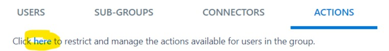

There are four persona
- Management 
- Security  
- Residents 
- Association members 
## Groups to be created
Login in to the web application and create below groups and add different persona members
- Operations 
    - Create group
    - Add management & association members
    - Deactivate all default actions
    
    Click on Admin, Member checkbox and click on "Save".
- Security
    - Create group
    - Add security members
- BMS 
    - Create group
    - Add management members
- Residents
    - Create a Public Groups
    - Add all the members as subscribers

## Management team responsibilities
This team is part of the operations group
- House keeping    
    Responsible to ensure that building premises is clean.
- Technical team   
    Different variety of technical issues needs to be handled by this team eg: Electrical, Plumbing, Carpenter, Water Treatment Plant, Sewage Treatment Plant.

Q1) How to ensure that every equipment is working?
A1) it is possible by checking it every day, but this needs to be recorded digitally so that the association team can verify through reports. So the solution is creating the Daily / Monthly / Quarterly check lists. 

- Daily checklists
  - LT panel
  - Transformer
  - Diesel generator
  - Lifts
  - Water treatment plant 
  - Sewage treatment verification
- Monthly check lists
  - Fire extinguisher
  - CCTV Cameras
 - Quarterly check lists
  - Gym equipments
  - Swimming pool water pumps

Q2) How to create a custom checklist?

A2) [Custom Checklist](CustomChecklist.md)
