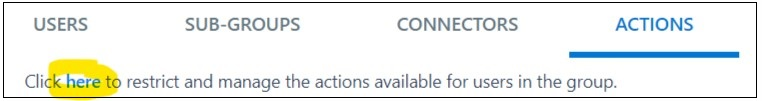

# Get Started
There are four personas
- Operations (Building Management Team) 
- Security  
- Residents 
- Association members 
## Groups to be created
Login in to the web application and create below groups and add different persona members
- [Operations](Operations.md)
    - Create group
    - Add management & association members
    - Deactivate all default actions
    
    Click on Admin, Member checkbox and click on "Save".
- [Security](Security.md)
    - Create group
     - Deactivate all default actions
    
    Click on Admin, Member checkbox and click on "Save".
    - Add security members
- BMS 
    - Create group
    - Add Operation team admin members
- [Residents](Residents.md)
    - Create a Public Groups
    - Deactivate all default actions
    
    - Add all the members as subscribers

## Click on the each Group 
- Group 1: [Operations](Operations.md)
- Group 2: [Security](Security.md)
- Group 3: [Residents](Residents.md)