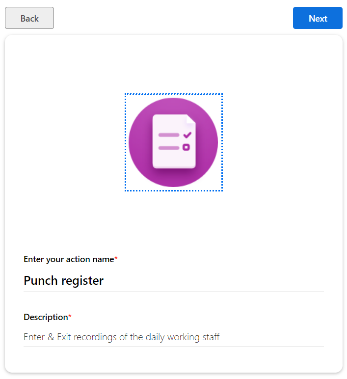
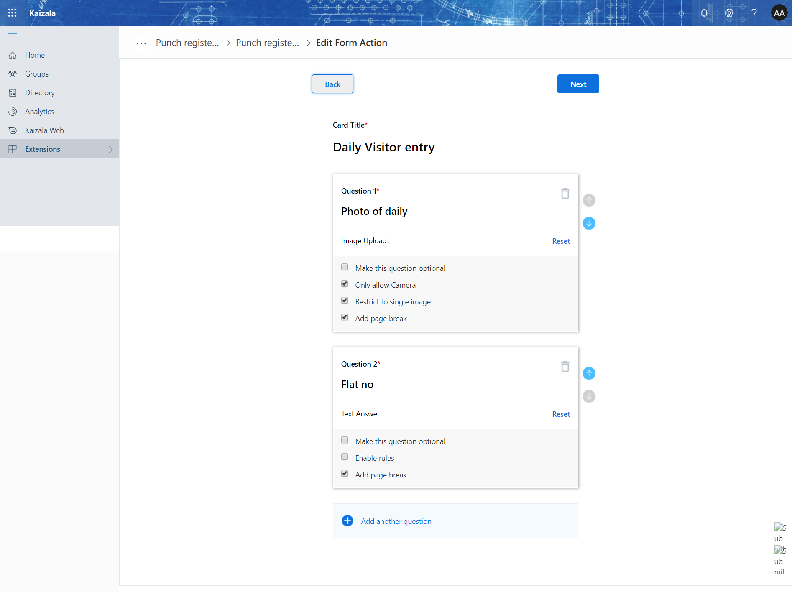
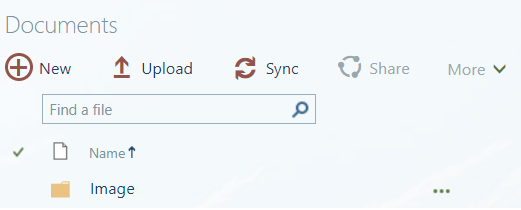
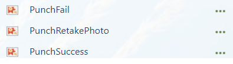
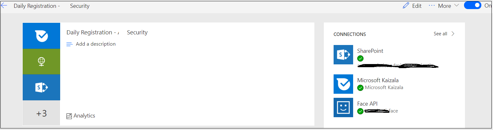
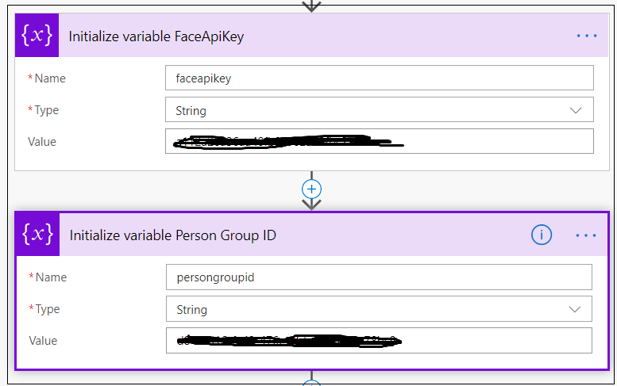

# Punch Register to "Security" Group

Security team has to take the entry of everyone coming in to the premise and going outsid of the premise.

This action card is used to take the entry of the person coming in to the premise. The attached flow is going to the card used the face API and identify the person and allow in to the premise. 

## Prerequisite 
[Daily Entry](DailyEntryRegistration.md) action card needs to be setup and made it available.

## Follow the below steps and setup
- Step 1: Create the action card.
 
 

- Step 2: Need to upload few images to sharepoint. These images are used in announcements that a flow sends to security team.
    - Sharepoint images upload location
    
    - Images to be uploaded
    

- Step 3: Verify whether lists are added in the the sharepoint. These are already created as a part of [Daily Entry](DailyEntryRegistration.md)

List Names
    - Daily Entry
    - Identity Failure

- Step 4: Import the flow [Zip](Media/PunchRegister/PunchRegister_20190323083800.zip), While importing connect with the FACE API 

    - Need to update the "faceapikey"
    - Create the "PersonGroupID" from the face API using the postman or any other URL request posting tool.
    - Update the "PersonGroupId" in the initialize variables

