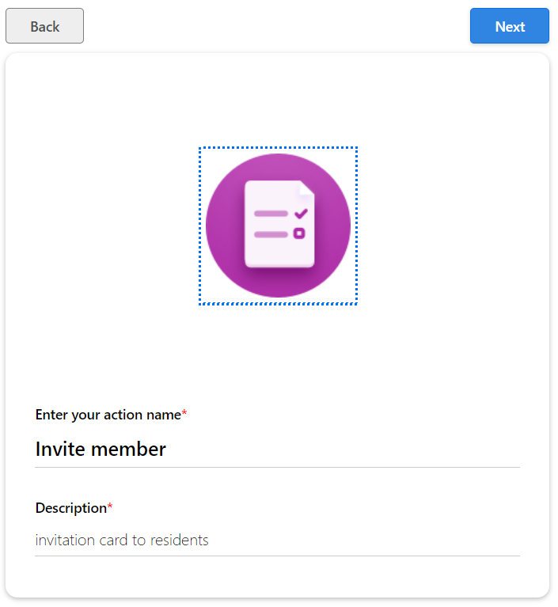
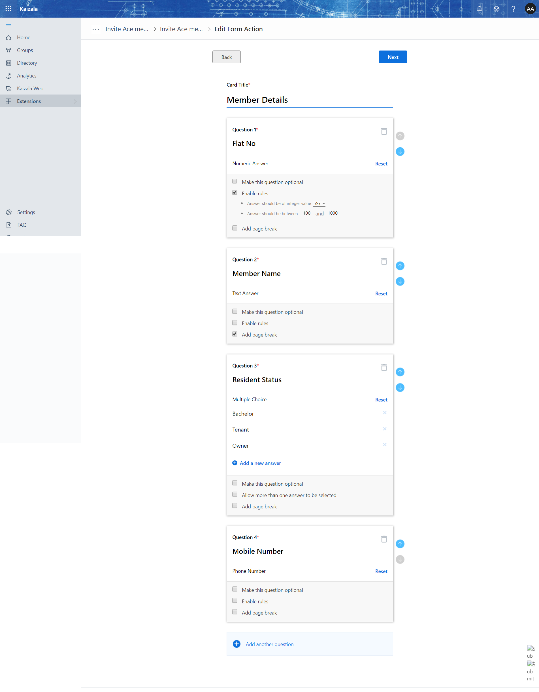

# Invite the members to "Residents"
This Action Card & Flow would help you in adding the members as "subscribers" to Residents group.

With Office 365, the admin will have an option to create a sharepoint site. create a site and it will be available as https://<sitename>.sharepoint.com

- Create a list with name as "Residents"
    Add the below list of columns 
    - "Flat No"
    - "Member Name"
    - "Phone Number"
    - "ResidentType"
    - "Invited By"
    - "Invited By PhoneNumber"
- Create a Action card 
    -  
    -  
    Download the package by clicking on the "flow Package" , While importing the package, choose the connections by authentication.
    -  [Flow Package](Media/InviteMember/InviteMember_20190319234734.zip)

- Login in to https://flow.microsoft.com and import the flow