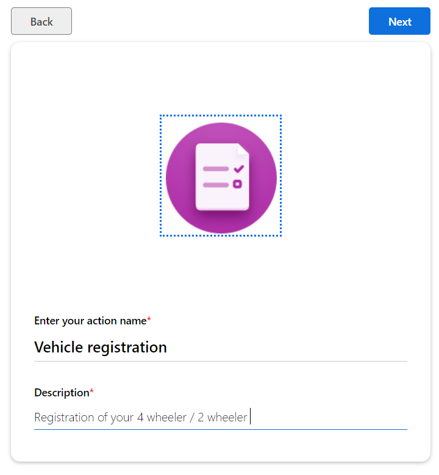
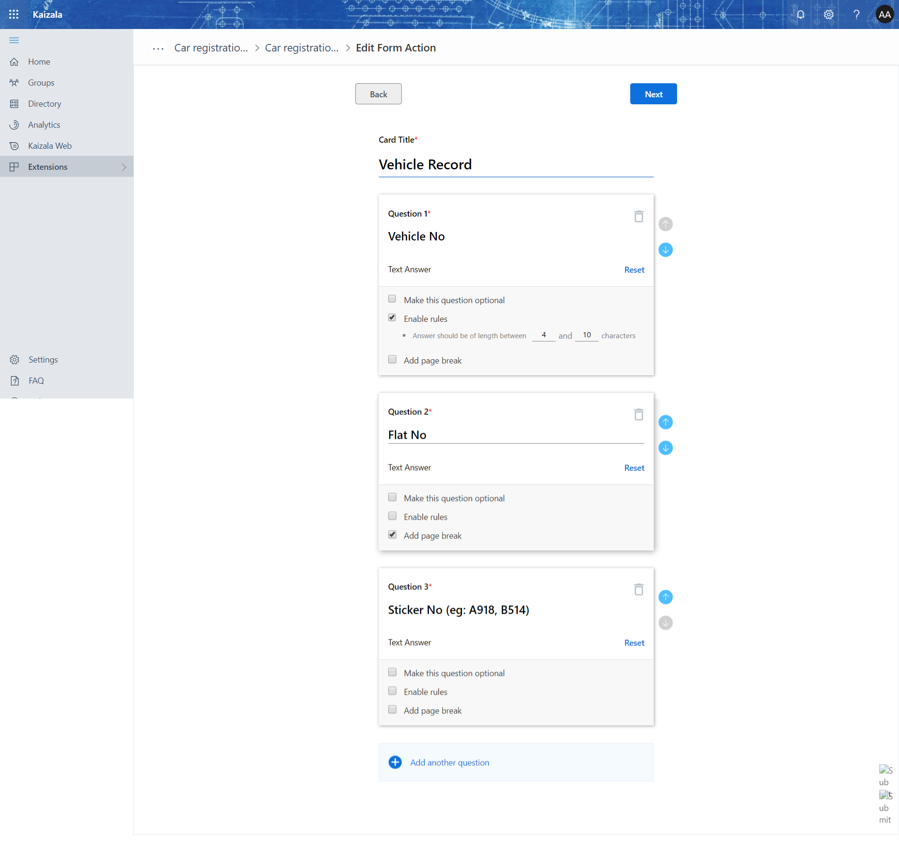
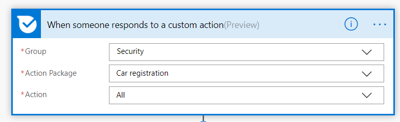

# Vehicle registration

Registration of any 2 wheeler / 4 wheeler vehicle that an individual is holding.

Note: We will be using the "VistorRecord" sharepoint list used to record the visitor. If not created add the list as below.

- Step 1: Create the [SharePoint list](https://support.office.com/en-us/article/Create-a-list-in-SharePoint-0D397414-D95F-41EB-ADDD-5E6EFF41B083)
    - List Name: "VisitorRecord"

List of columns

| Column Name | Data Type |
| --- | --- |
| Purpose of Visit | Single line of text |
| Visitor Name | Single line of text |
| Flat No | Single line of text |
| VehicleNumber | Single line of text |
| Where From | Single line of text |
| Registration Number | Single line of text |
| photourl | Multiple lines of text |
| Comments | Single line of text |

- Step 2: Create the Action
    -  Step 2.1: 
    -  Step 2.2: 
    -  Step 2.3: Attach the card to the Security, Operations, Residents group so that everyone can register the vehicle

- Step 3: Import the [flow](Media/VehicleRegistration/VehicleRegistartion_Flow_20190323134837.zip)
- Step 4: If you add the action card to three groups, then import the flow for three times and attach it to appropriate groups in the first step.
