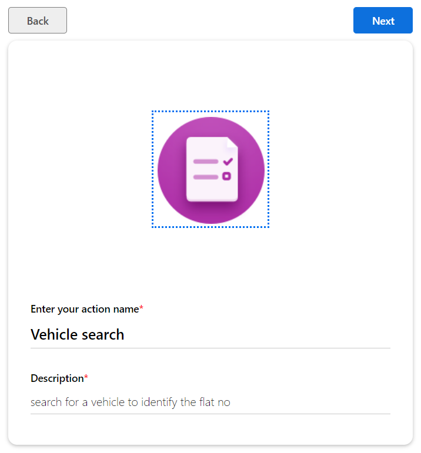
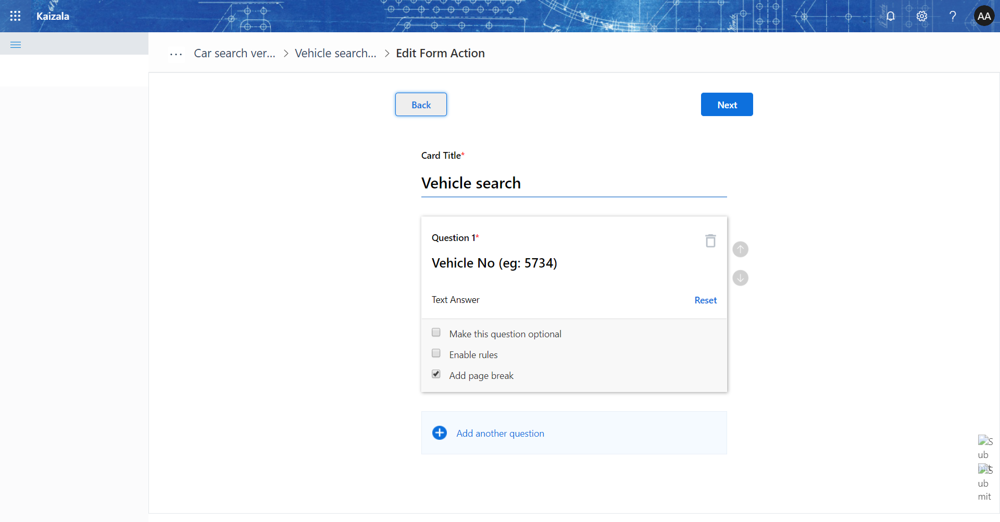
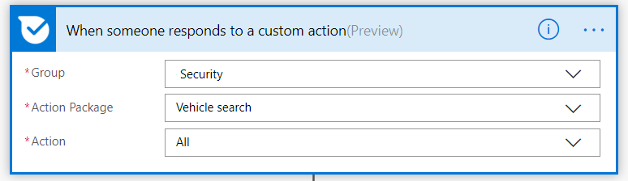

# Vehicle Search

This is used for search for the vehicle.

- Step 1: Create the Action
    -  Step 1.1: 
    -  Step 1.2: 
    -  Step 1.3: Attach the card to the Security, Operations, Residents group so that everyone can register the vehicle

- Step 2: Import the [flow](Media/VehicleSearch/VehicleSearch-Flow_20190323142737.zip)
- Step 3: If you add the action card to three groups, then import the flow for three times and attach it to appropriate groups in the first step.
